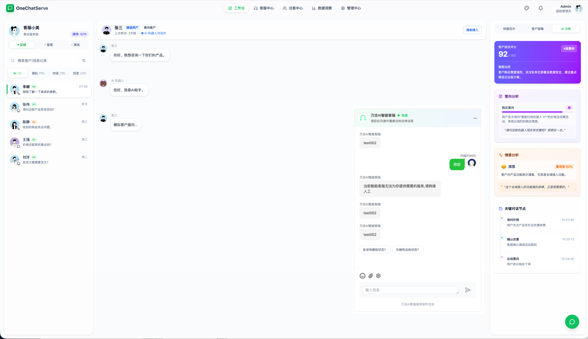
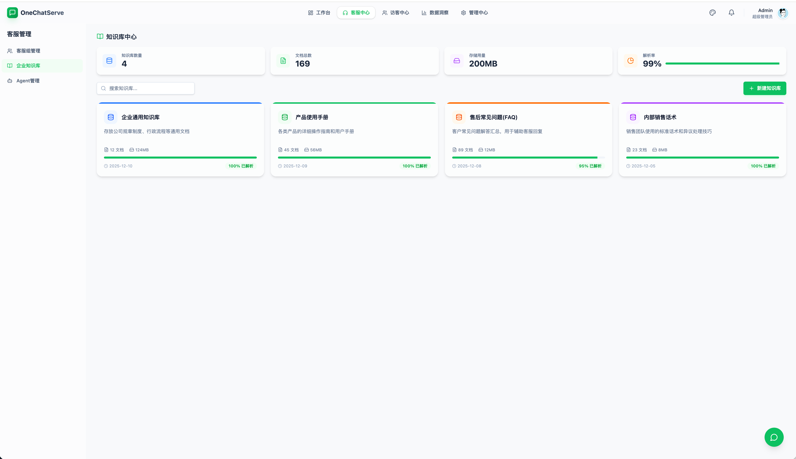
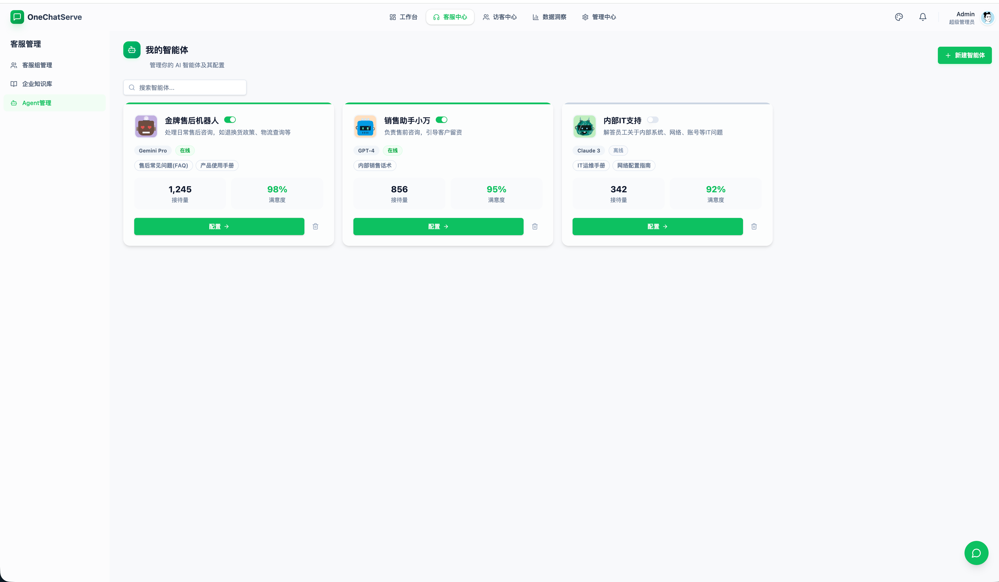

简体中文 | [English](./README.en.md)

## 0.关于项目

### 0.1 找到我们
- 官网(技术文档等)：[https://1chatserve.com](https://1chatserve.com)
- Github: https://github.com/OneChatAIServe/AI-1ChatServe
- Gitee: https://gitee.com/visualinsur-xbkj/1ChatServe
- GitCode: https://gitcode.com/OneChatServe/1ChatServe

### 0.2 前端仓库
- 地址：[https://gitee.com/hixinla/1-chat-serve-front](https://gitee.com/hixinla/1-chat-serve-front)

### 0.3 在线演示(可添加好友获取)

### 0.4 演示截图

## 1. 项目背景

在数字化转型的浪潮下，企业面临着诸多严峻挑战：
- **渠道分散**：客户触点遍布网页、APP、微信生态、社交媒体等多个平台，管理混乱且效率低下
- **数据割裂**：各渠道客户数据无法统一，难以形成完整客户画像和精准服务
- **服务标准化不足**：人工客服水平参差不齐，缺乏统一的服务标准和自动化支持
- **成本压力**：传统商业客服系统价格昂贵，功能受限，难以满足个性化需求
- **安全与隐私顾虑**：客户数据存储在第三方平台，存在数据泄露和隐私风险
- **本地化需求**：部分企业需要在本地部署系统，以满足合规性和数据主权要求

传统商业客服系统已无法满足企业对全域、智能化、一体化、安全可控的客户服务需求。

为了解决这些痛点，我们推出了 **「万洽(1ChatServe)」—— 一款开源的全域AI智能客服解决方案** 。

通过开源模式，企业可以获得更高的安全性、更强的定制能力、更低的使用成本，以及完全的数据控制权。

万洽旨在帮助企业构建 **「获客 - 服务 - 运营 - 决策 - 保障」** 的业务闭环，实现客户服务的智能化、标准化和一体化管理，提升客户体验和服务效率，沉淀客户资产价值。

## 2. 项目简介

### 2.1 定位
全域AI智能客服解决方案

### 2.2 Slogan
连接全域，智洽无界，客户服务从此一体

### 2.3 核心价值

万洽从「生态链接（获客入口）→ 客服规则引擎（服务标准）→ 工作台（作业执行）→ 客户资产（价值沉淀）→ 数据洞察（决策优化）→ 系统配置（基础保障）」，形成完整的业务闭环，为企业提供全方位的智能客服解决方案。

## 3. 产品架构

### 3.1 核心模块

- 全域生态连接器：连接多端客户触点，实现全域统一接入与管理。
- 智能客服规则中心：通过规则与AI构建自动化服务体系，提升服务效率与标准化。
- 智能运营工作台：承载客服日常作业全流程，结合AI能力提升服务质量。
- 客户资产增长中心：沉淀客户数据，构建客户画像，实现客户价值最大化。
- 智能数据洞察中心：通过数据分析与可视化，驱动运营决策与服务优化。
- 全局系统配置中心：保障平台稳定运行与全局管控，支持个性化配置需求。

### 3.2 AI能力集成
- 智能意图识别：基于深度学习的用户意图分析
- 情感分析引擎：实时分析客户情绪状态
- 智能回复推荐：根据上下文提供智能回复建议
- 多语言翻译：支持实时对话翻译
- 客户画像构建：基于行为数据生成客户标签
- 风险识别预警：识别潜在的违规内容和风险行为

## 4. 项目部署

### 4.1 技术栈

**前端技术栈**：ES6、Vue3、Vuex、Vue-router、Vue-cli、Axios、Element-ui

**后端技术栈**：Spring Boot、Spring Cloud & Alibaba、Nacos、Mybatis-plus、xxljob、RabbitMQ、Forest

**数据库**：MySQL

### 4.2 前端部署

*正在加急上线中...*

### 4.3 后端部署

*正在加急上线中...*

## 5. 项目优势

**全域一体化**：统一接入管理多端客户触点，打破数据孤岛

**AI智能驱动**：集成AI能力，实现智能分配、智能回复、智能分析

**灵活可扩展**：模块化架构设计，支持功能定制和二次开发

**开源策略**：基于开源协议，企业可自由使用、修改和部署

**易于部署**：支持本地部署和云端部署，适应不同企业需求

**完善的生态**：提供丰富的API接口，方便与企业现有系统集成

## 6. 参与贡献

我们欢迎社区开发者参与万洽的开发和完善，共同打造优秀的开源智能客服解决方案。

### 6.1 贡献方式

1. **提交Issue**：报告bug、提出功能建议或改进意见
2. **提交Pull Request**：修复bug、实现新功能或优化代码
3. **文档贡献**：完善文档、翻译内容或编写教程
4. **社区参与**：回答问题、分享经验或组织活动

### 6.2 联系方式
1. **技术交流**：加入我们的技术交流群,与其他开发者交流技术经验，解决问题
2. **商业合作**：商业合作机会，包括定制开发、技术支持、解决方案合作等

## 7. 版权声明

万洽AI客服(1ChatServe)开源版遵循 GPL-3.0 开源协议发布，并提供免费研究使用，但绝不允许修改后和衍生的代码做为闭源的商业软件发布和销售,若需商业授权联系作者

## 8. 致谢

感谢以下优秀的开源项目为本项目提供支持:
- [T-IO](https://gitee.com/tywo45/t-io)：基于java aio研发的高性能网络编程框架
- [RuoYi-Cloud](https://gitee.com/y_project/RuoYi-Cloud)：基于java的成熟的企业级快速开发框架
- [Langchain4j](https://github.com/langchain4j/langchain4j)：强大的 Java LLM 开发框架
---

